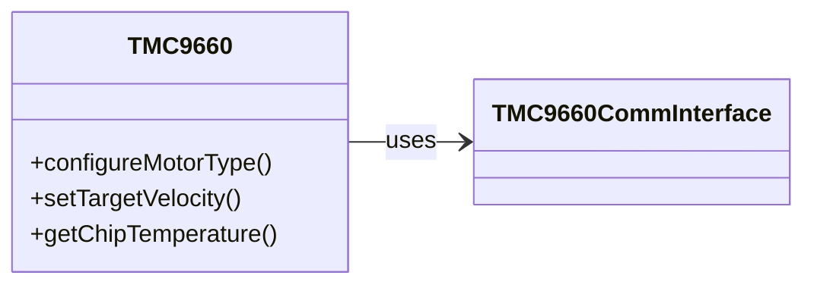

# HF-TMC9660
Hardware Agnostic TMC9660 library - as used in the HardFOC-V1 controller

# TMC9660 – C++ Driver Library

[](https://www.gnu.org/licenses/gpl-3.0)

## 📦 Overview
**HF-TMC9660** is a portable C++17 driver for the **TMC9660** motor controller from Trinamic. It exposes the full parameter mode interface with FOC control, telemetry readback and TMCL scripting. The driver is transport agnostic – implement `TMC9660CommInterface` for SPI or UART and run it on any MCU or host.

## 📜 Table of Contents
1. [Highlights](#-driver-highlights)
2. [Features](#-features)
3. [Library Architecture](#-library-architecture)
4. [Platform Integration](#-platform-integration)
5. [Project Structure](#-project-structure)
6. [Installation](#-installation)
7. [Quick Start](#-quick-start)
8. [Usage Examples](#-usage-examples)
9. [Contributing](#-contributing)
10. [License](#-license)
11. [Resources](#-resources)

## 🚀 Driver Highlights
* **FOC control** for torque, velocity and position
* **Commutation modes** for BLDC, DC and stepper motors
* **Hardware independence** through `TMC9660CommInterface`
* **Telemetry & RAMDebug** for temperature, current and voltage logs
* **TMCL scripting** to execute commands on the device

## ✨ Features
|   | Capability |
|---|------------|
| 🛠️ **Hardware-Agnostic** | Abstract `TMC9660CommInterface` allows SPI or UART transports so the driver runs on any MCU or host. |
| 🎛️ **Comprehensive Configuration** | Access all Parameter Mode features: set motor type, commutation, gate driver, sensors and more. |
| 🎯 **FOC & Motion Control** | Built-in FOC provides torque, velocity and position loops for DC, BLDC or stepper motors. |
| 📈 **Telemetry & RAMDebug** | Read temperature, current, voltage and capture high-rate logs with the on-chip RAMDebug system. |
| 📜 **TMCL Scripting** | Upload and run TMCL programs directly on the device for custom standalone behavior. |
| 🛡️ **Protection Settings** | Configure over-voltage, under-voltage, temperature and over-current limits to keep your hardware safe. |

---

## 🏗️️ Library Architecture
This library centers around a single `TMC9660` class that communicates via an abstract `TMC9660CommInterface`. You provide a subclass that implements `transferDatagram()` for your platform. All parameter mode commands and telemetry queries are wrapped by the `TMC9660` class in a clean C++ API.



### Communication Interface
```cpp
class TMC9660CommInterface {
public:
    virtual ~TMC9660CommInterface() = default;
    virtual bool transferDatagram(const std::array<uint8_t,8>& tx,
                                  std::array<uint8_t,8>& rx) = 0;
};
```

## 🔌 Platform Integration
Implement `TMC9660CommInterface` for your target platform. Here is a minimal dummy interface used by the examples:
```cpp
class DemoInterface : public TMC9660CommInterface {
public:
    bool transferDatagram(const std::array<uint8_t,8>& tx,
                          std::array<uint8_t,8>& rx) override {
        rx = tx; // echo back for demo purposes
        return true;
    }
};
```

---

## 📂 Project Structure
```
Datasheet/  Reference PDFs
examples/   Usage examples
inc/        Public headers
src/        Driver sources
```

## 🔧 Installation
1. Copy the contents of `inc/` and `src/` into your project.
2. Implement `TMC9660CommInterface` for your hardware.
3. Compile with a C++17 (or later) compiler.
4. Optionally build the examples:
```bash
g++ -std=c++17 -Iinc src/TMC9660.cpp examples/BLDC_with_HALL.cpp -o demo
```

## 💡 Quick Start
```cpp
DemoInterface bus;
TMC9660 driver(bus);

driver.configureMotorType(TMC9660::MotorType::BLDC, 7);
driver.setCommutationMode(TMC9660::CommutationMode::FOC_HALL);
driver.setTargetVelocity(1000);
```
Replace `DemoInterface` with your SPI or UART implementation to talk to real hardware.

## 💻 Usage Examples
The `examples` folder contains small programs showing typical workflows.
- **BLDC_with_HALL.cpp** – run a BLDC motor using Hall sensor feedback.
- **BLDC_velocity_control.cpp** – drive a brushed DC motor in velocity mode.
- **Telemetry_monitor.cpp** – continuously read temperature, current and voltage.

Compile these along with `src/TMC9660.cpp` and your interface implementation to try them out.

## 🙌 Contributing
Pull requests and feature ideas are welcome! Please format code with `clang-format` and sign off your commits.

## 📄 License
This project is licensed under the **GNU GPL v3.0**. See [LICENSE](LICENSE).

## 📚 Resources
* Trinamic TMC9660 datasheet (see `Datasheet/` folder)
