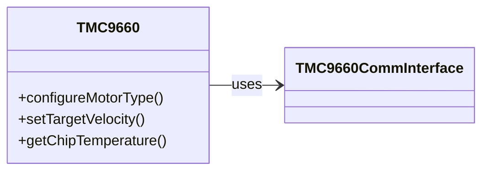

# HF-TMC9660
Hardware Agnostic TMC9660 library - as used in the HardFOC-V1 controller

# TMC9660 – C++ Driver Library

[](https://www.gnu.org/licenses/gpl-3.0)

## 📦 Overview
**HF-TMC9660** is a portable C++20 driver for the **TMC9660** motor controller from Trinamic. It exposes the full parameter mode interface with FOC control, telemetry readback and TMCL scripting. The driver is transport agnostic – implement `TMC9660CommInterface` for SPI or UART and run it on any MCU or host.

## 📜 Table of Contents
1. [Highlights](#-driver-highlights)
2. [Features](#-features)
3. [Requirements](#-requirements)
4. [Library Architecture](#-library-architecture)
5. [Platform Integration](#-platform-integration)
6. [Project Structure](#-project-structure)
7. [Installation](#-installation)
8. [Quick Start](#-quick-start)
9. [Usage Examples](#-usage-examples)
10. [Contributing](#-contributing)
11. [License](#-license)
12. [Resources](#-resources)

## 🚀 Driver Highlights
* **FOC control** for torque, velocity and position
* **Commutation modes** for BLDC, DC and stepper motors
* **Hardware independence** through `TMC9660CommInterface`
* **Telemetry & RAMDebug** for temperature, current and voltage logs
* **TMCL scripting** to execute commands on the device

## ✨ Features
|   | Capability |
|---|------------|
| 🛠️ **Hardware-Agnostic** | Abstract `TMC9660CommInterface` allows SPI or UART transports so the driver runs on any MCU or host. |
| 🎛️ **Comprehensive Configuration** | Access all Parameter Mode features: set motor type, commutation, gate driver, sensors and more. |
| 🎯 **FOC & Motion Control** | Built-in FOC provides torque, velocity and position loops for DC, BLDC or stepper motors. |
| 📈 **Telemetry & RAMDebug** | Read temperature, current, voltage and capture high-rate logs with the on-chip RAMDebug system. |
| 📜 **TMCL Scripting** | Upload and run TMCL programs directly on the device for custom standalone behavior. |
| 🛡️ **Protection Settings** | Configure over-voltage, under-voltage, temperature and over-current limits to keep your hardware safe. |

---

## 📋 Requirements
* **C++20 compiler** – tested with GCC and Clang.
* **Standard C++ library** providing `std::span`.
* **Communication hardware** providing SPI or UART to talk to the TMC9660.

## 🏗️️ Library Architecture
This library centers around a single `TMC9660` class that communicates via an abstract `TMC9660CommInterface`. You provide a subclass that implements the low level transfer (e.g. `spiTransfer()` for SPI) for your platform. All parameter mode commands and telemetry queries are wrapped by the `TMC9660` class in a clean C++ API.



### Communication Interface
```cpp
class TMC9660CommInterface {
public:
    virtual ~TMC9660CommInterface() = default;
    virtual CommMode mode() const noexcept = 0;

    /// Send @p tx and decode reply according to the active mode.
    /// @param address 7-bit module address (UART only).
    virtual bool transfer(const TMCLFrame& tx,
                          TMCLReply& reply,
                          uint8_t address) noexcept = 0;
};
```

## 🔌 Platform Integration
Implement `TMC9660CommInterface` for your target platform. Here is a minimal dummy interface used by the examples:
```cpp
class DemoInterface : public SPITMC9660CommInterface {
public:
    bool spiTransfer(std::array<uint8_t,8>& tx,
                     std::array<uint8_t,8>& rx) noexcept override {
        rx = tx; // echo back for demo purposes
        return true;
    }
};
```
The `spiTransfer()` method must exchange an 8‑byte datagram with the
device. On SPI this typically means toggling chip select, sending the bytes
and reading the reply back.

---

## 📂 Project Structure
```
Datasheet/  Reference PDFs
examples/   Usage examples
inc/        Public headers
src/        Driver sources
```

## 🔧 Installation
1. Clone this repository or copy the `inc/` and `src/` directories into your project tree.
2. Implement `TMC9660CommInterface` for your hardware (SPI or UART).
3. Compile `src/TMC9660.cpp` together with your application using a C++20 (or later) compiler.
4. Optionally build the examples to verify your setup:
```bash
g++ -std=c++20 -Iinc src/TMC9660.cpp examples/BLDC_with_HALL.cpp -o hall_demo
```

## 💡 Quick Start
```cpp
DemoInterface bus;
TMC9660 driver(bus);

driver.configureMotorType(TMC9660::MotorType::BLDC, 7);
driver.setCommutationMode(TMC9660::CommutationMode::FOC_HALL);
driver.setTargetVelocity(1000);
```
Replace `DemoInterface` with your SPI or UART implementation to talk to real hardware.
All API calls return a boolean status so you can handle communication errors if needed.

### Building the Examples
Compile one of the sample programs to verify everything is wired up correctly:
```bash
g++ -std=c++20 -Iinc src/TMC9660.cpp examples/BLDC_with_HALL.cpp -o hall_demo
```

## 💻 Usage Examples
The `examples` folder contains programs demonstrating the most common tasks.

- **bootloader_example.cpp** – write bootloader configuration registers.
- **BLDC_with_HALL.cpp** – run a BLDC motor using Hall sensor feedback.
- **BLDC_with_ABN.cpp** – closed-loop FOC using an incremental encoder.
- **BLDC_velocity_control.cpp** – drive a brushed DC motor with a simple velocity loop.
- **DC_current_control.cpp** – open-loop current drive for a DC motor.
- **Stepper_FOC.cpp** – position control of a stepper using FOC and an encoder.
- **Stepper_step_dir.cpp** – enable the STEP/DIR interface with extrapolation.
- **Telemetry_monitor.cpp** – continuously read temperature, current and voltage values.

Compile these along with `src/TMC9660.cpp` and your own implementation of
`TMC9660CommInterface` (the examples use a simple `DummyBus` stub).  A more
in-depth walkthrough of each scenario is provided in
`docs/HardwareAgnosticExamples.md`.

## 🙌 Contributing
Pull requests and feature ideas are welcome! Please format code with `clang-format` and sign off your commits.

## 📄 License
This project is licensed under the **GNU GPL v3.0**. See [LICENSE](LICENSE).

## 📚 Resources
* Trinamic TMC9660 datasheet (see `Datasheet/` folder)
