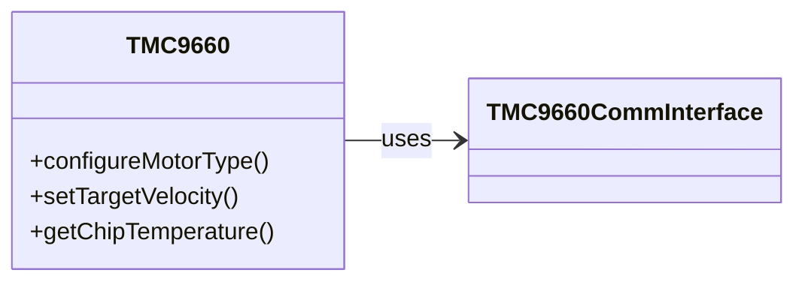

# HF - TMC9660
Hardware Agnostic TMC9660 library - as used in the HardFOC-V1 controller

# TMC9660 C++ Motor Driver 🚀

> **Hardware-agnostic Parameter Mode driver for the Trinamic TMC9660**


---

## 📜 Table of Contents
1. [Features ✨](#features-✨)
2. [Architecture 📐](#architecture-📐)
3. [Getting Started 🏁](#getting-started-🏁)
4. [Usage Examples 💻](#usage-examples-💻)
5. [Contributing 🤝](#contributing-🤝)
6. [License 📄](#license-📄)
7. [Acknowledgements 🙏](#acknowledgements-🙏)

---

## Features ✨

|   | Capability |
|---|------------|
| 🛠️ **Hardware-Agnostic** | Abstract `TMC9660CommInterface` allows SPI or UART transports, so the driver runs on any MCU or host. |
| 🎛️ **Comprehensive Configuration** | Access all Parameter Mode features: set motor type, commutation, gate driver, sensors and more. |
| 🎯 **FOC & Motion Control** | Built-in FOC provides torque, velocity and position loops for DC, BLDC or stepper motors. |
| 📈 **Telemetry & RAMDebug** | Read temperature, current, voltage and capture high-rate logs with the on-chip RAMDebug system. |
| 📜 **TMCL Scripting** | Upload and run TMCL programs directly on the device for custom standalone behavior. |
| 🛡️ **Protection Settings** | Configure over-voltage, under-voltage, temperature and over-current limits to keep your hardware safe. |

## Architecture 📐

The driver class is hardware-independent; you implement the transport in a subclass of `TMC9660CommInterface`.

## Getting Started 🏁

```bash
# Clone the repository
git clone --depth=1 https://github.com/yourOrg/HF-TMC9660.git
cd HF-TMC9660

# Build an example (using g++)
g++ -std=c++17 -Iinc src/TMC9660.cpp examples/BLDC_with_HALL.cpp -o demo
```

Implement your own communication interface for SPI or UART and link it with the library.

## Usage Examples 💻

The `examples` folder contains small programs showing typical workflows.

- **BLDC_with_HALL.cpp** – run a BLDC motor using Hall sensor feedback.
- **BLDC_velocity_control.cpp** – drive a brushed DC motor in velocity mode.
- **Telemetry_monitor.cpp** – continuously read temperature, current and voltage.

Compile these along with `src/TMC9660.cpp` and your interface implementation to try them out.

## Contributing 🤝

Pull requests are welcome! Please format your code with `clang-format` and sign off your commits.

## License 📄

This project is licensed under the terms of the **GNU GPL v3**. See [LICENSE](LICENSE) for details.

## Acknowledgements 🙏

Thanks to Trinamic for the TMC9660 documentation and everyone contributing to open source motor control.
